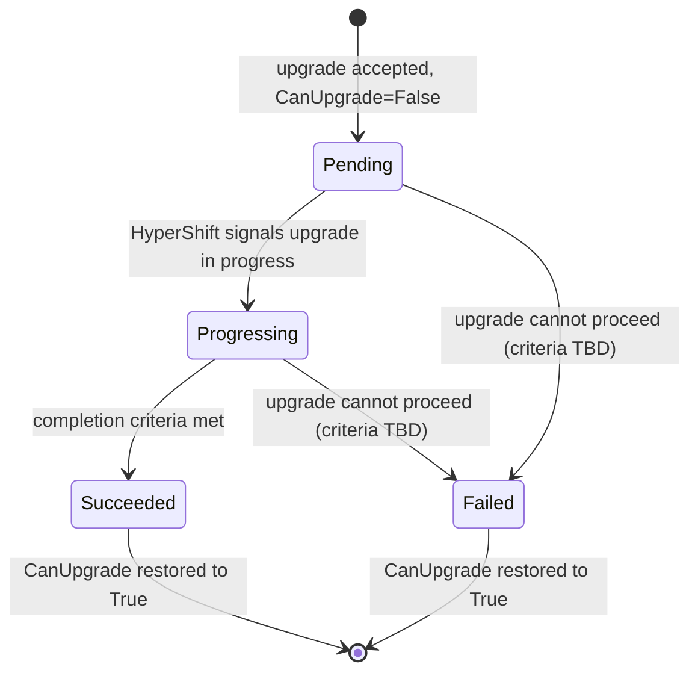

# Cluster Upgrade — CaaS (Phase 1)

## Summary

Phase 1 of CaaS cluster upgrades lets tenants independently upgrade the control plane and individual node pools of an HCP OpenShift cluster by patching `Cluster.spec.version` (CP) or `Cluster.spec.node_sets[*].version` (per-NP). The fulfillment-service validates the request and resolves the target version to a release image. As with scaling, the osac-operator launches the existing cluster AAP job when an image changes. An upgrade-only branch patches `spec.release.image` on the selected existing `HostedCluster` or `NodePool`; HyperShift then reconciles the upgrade without cluster reprovisioning. Only one upgrade operation runs at a time; upgrades are blocked when `Cluster.status.state` is `FAILED`, `DELETING`, or `DELETE_FAILED`, or when `conditions[CanUpgrade]` is not yet `True`.

## Motivation

OSAC provisions HyperShift Hosted Control Plane clusters via two control loops: the fulfillment-service projects DB state to `ClusterOrder` CRs, and the osac-operator provisions via AAP. The operator has read-only access to `HostedCluster` and `NodePool`; all mutations — including scaling — are applied through AAP. Tenants have no API surface to upgrade a cluster. The AAP job used for scaling runs the selected template's `install` role, including infrastructure and readiness tasks, so an unmodified run is too broad for a version-only update.

Phase 1 uses the same AAP cluster job as scaling, with an upgrade operation that applies only the release image on the selected existing HyperShift resource. The create/scale operation retains its current path.

### Goals

- Enable independent CP upgrades via `PATCH Cluster.spec.version`.
- Enable independent per-NP upgrades via `PATCH Cluster.spec.node_sets[*].version`.
- Enforce sequential upgrades: only clusters with `conditions[CanUpgrade]=True` accept upgrade spec mutations.
- Enforce version skew: NP version ≤ CP version, within N-3 minor versions of CP; CP upgrade target must not leave any existing node pool more than N-3 minor versions behind.
- Reject downgrade attempts and OBSOLETE version targets.
- Surface upgrade state, observed version, and upgrade history in `Cluster.status`.
- Support version upgrades via `osac edit cluster` (interactive) and a new non-interactive `osac upgrade cluster` command (`scale cluster` pattern: positional cluster name, `--control-plane` for CP targeting, `--node-set` for NP targeting, `--version` accepting `ClusterVersion.metadata.name` or `ClusterVersion.spec.version` string).
- Extend the OSAC UI: version selection with pre-filtering (only eligible versions shown — not OBSOLETE; excludes downgrades against current observed version; skew rules applied client-side), upgrade status monitoring, upgrade history, and upgrade action gating (trigger disabled with tooltip when `status.state ∈ {DELETING, DELETE_FAILED, FAILED}` or `conditions[CanUpgrade] != True`, surfacing the blocking reason) [NFR-1].
- Reuse AAP for HyperShift mutations while keeping the osac-operator's `HostedCluster` and `NodePool` access read-only.

### Non-Goals

- Concurrent upgrades (CP + NP simultaneously, or NP + NP) — one operation at a time is enforced; concurrent upgrades are a non-goal.
- Channel switching and version discovery via the OpenShift upgrade graph / OSUS — deferred to Phase 2 (FR-3).
- Risk review or explicit risk acknowledgment — auto-acknowledged in Phase 1; deferred to Phase 2 (FR-4, FR-5).
- Cancellation window before HyperShift propagation — deferred to Phase 2 (FR-6).
- Version divergence notifications when NPs lag behind CP (FR-14).
- EOL/limited-support visibility (FR-15).
- Tenant Admin fleet view for clusters requiring upgrades (NFR-admin).
- SNO or non-HCP clusters.
- Rollback or downgrade.
- Platform-initiated upgrades.
- Cancel running upgrades (HyperShift does not support it).
- Running installation, infrastructure, readiness, or post-install tasks for a version-only change.
- OSAC-owned persistent upgrade history — Phase 1 relays HyperShift's limited history; operator records NP completion.

## Proposal

Phase 1 adds two independent upgrade paths to the OSAC cluster API:

1. **CP upgrade:** tenant PATCHes `spec.version`; fulfillment-service validates (including N-3 skew) and resolves to `ClusterOrder.spec.ReleaseImage`; operator detects HC image divergence and launches the existing AAP cluster job in upgrade mode to patch `HostedCluster.spec.release.image`.
2. **NP upgrade:** tenant PATCHes `spec.node_sets[<name>].version`; fulfillment-service validates (including N-3 skew) and resolves the version onto the `NodeRequest` for that node set's resource class; operator detects image divergence on the matching NodePool and launches the same AAP cluster job in upgrade mode to patch its `spec.release.image`.

Both paths reuse the configured create-hosted-cluster AAP template (or workflow) with an update-only operation; they do not require a new job template. Fulfillment sets each node set's desired `ClusterVersionReference` to the selected control-plane version during Cluster creation. It owns the `CanUpgrade` condition in its DB for initial HyperShift creation and upgrades: it sets `False` in the Cluster creation or upgrade-acceptance transaction and `True` in the transaction that records initial cluster readiness or a terminal upgrade result (success or failure). The osac-operator monitors the AAP job and HyperShift, and reports upgrade status through the existing private Cluster Update path. ClusterOrder provisioning status is not changed by an upgrade.

### Workflow Description

#### High-Level Pipeline

**Control plane upgrade:**

```
User
 │
 ▼
CLI (upgrade_cmd.go / edit_cmd.go)
 │  gRPC: ClustersUpdateRequest spec.version={name: "4-17-3"}
 │  update_mask: ["spec.version"]
 ▼
Fulfillment-Service API (clusters_server.go)
 │  1. validateUpgradeEligibility: state ∉ {DELETING,DELETE_FAILED,FAILED}, CanUpgrade=True
 │  2. validateVersionUpdate: ClusterVersion catalog lookup → validates target
 │  3. PostgreSQL: persist spec.version + CanUpgrade=False (atomic)
 ▼
Cluster Reconciler (cluster_reconciler_function.go)
 │  buildSpec resolves ClusterVersion.spec.image from spec.version
 │  K8s PATCH: ClusterOrder.spec.ReleaseImage
 ▼
osac-operator (clusterorder_controller.go)
 │  HC image divergence → CP upgrade path
 │  launch and track existing AAP cluster job in upgrade mode
 ▼
AAP create-hosted-cluster playbook (upgrade branch)
 │  PATCH existing HostedCluster.spec.release.image only
 ▼
HyperShift Controller
 │  desired.image == ClusterOrder.spec.ReleaseImage → Progressing
 │  history[0].image == target; state == Completed → Succeeded
 ▼
Status Feedback (feedback_controller.go)
 │  upgradeStatus → private Update → DB releases lock on successful completion or terminal upgrade failure
 ▼
CLI / UI (upgrade state and observed version updated)
```

**Node pool upgrade** (the selected node set maps to a `NodeRequest` and then to one NodePool by resource class; see Current NodePool Targeting below):

```
User
 │
 ▼
CLI (upgrade_cmd.go / edit_cmd.go)
 │  gRPC: ClustersUpdateRequest spec.node_sets[<name>].version={name: "4-16-5"}
 │  update_mask: ["spec.node_sets"]
 ▼
Fulfillment-Service API (clusters_server.go)
 │  1. validateUpgradeEligibility
 │  2. validateNPVersionUpdate: ClusterVersion catalog lookup → validates target
 │  3. PostgreSQL: persist selected node-set version + CanUpgrade=False (atomic)
 ▼
Cluster Reconciler (cluster_reconciler_function.go)
 │  buildSpec resolves ClusterVersion.spec.{image,version} for selected node set
 │  K8s PATCH: matching NodeRequest.{ReleaseImage,Version}
 ▼
osac-operator (clusterorder_controller.go)
 │  matched NodePool image divergence → NP upgrade path
 │  launch and track existing AAP cluster job in upgrade mode
 ▼
AAP create-hosted-cluster playbook (upgrade branch)
 │  PATCH matched existing NodePool.spec.release.image only
 ▼
HyperShift Controller
 │  conditions[UpdatingVersion]=True → upgradeStatus.state = Progressing
 │  UpdatingVersion=False + version==matched NodeRequest.Version → Succeeded
 ▼
Status Feedback (feedback_controller.go)
 │  upgradeStatus + observed_version → private Update → DB releases lock on successful completion or terminal upgrade failure
 ▼
CLI / UI (upgrade state and observed version updated)
```

#### Step 1 — CLI (`osac upgrade cluster`)

**Source file:** `fulfillment-service/cmd/osac/upgrade/upgrade_cmd.go`

```bash
osac upgrade cluster <cluster-name> --control-plane --version 4.17.3
osac upgrade cluster <cluster-name> --node-set compute --version 4.16.5
```

Interactive upgrades are also available via `osac edit cluster`.

The CLI performs the following steps:

1. Looks up the cluster by name or ID.
2. Validates that `--version` is provided and exactly one of `--control-plane` or `--node-set` is specified.
3. Resolves `--version` as `osac create cluster` does: match `ClusterVersion.metadata.name` or `ClusterVersion.spec.version`, preferring the name if both match different versions. Then clone and mutate the cluster proto (using the selected version's metadata name for both CP and NP references):
   - CP: `updated.GetSpec().SetVersion(publicv1.ClusterVersionReference_builder{Name: versionName}.Build())`
   - NP: `updated.GetSpec().GetNodeSets()[nodeSetName].SetVersion(publicv1.ClusterVersionReference_builder{Name: versionName}.Build())`
4. Sends update with a field mask:
   ```go
   client.Update(ctx, publicv1.ClustersUpdateRequest_builder{
       Object:     updated,
       UpdateMask: &fieldmaskpb.FieldMask{Paths: []string{"spec.version"}},  // or "spec.node_sets"
   }.Build())
   ```
5. Prints: `"Run 'osac describe cluster <name>' to monitor progress."`

The CLI has no kubeconfig and never calls the Kubernetes API.

#### Step 2 — Fulfillment-Service API

**Source file:** `fulfillment-service/internal/servers/clusters_server.go`

Resolve and validate the target `ClusterVersion` before locking the Cluster row. Then use the generic update path to lock the row (`SELECT ... FOR UPDATE`), apply the update mask, and check upgrade eligibility, observed versions, and skew against the locked Cluster.

**`validateUpgradeEligibility`** (new, called after locking the Cluster):
1. Reject `FAILED_PRECONDITION` if `state ∈ {DELETING, DELETE_FAILED, FAILED}`.
2. Reject `FAILED_PRECONDITION` if `conditions[CAN_UPGRADE].status != True`. The error message includes the blocking reason from the condition.

`PROGRESSING + CanUpgrade=True` passes both checks — AAP post-provisioning tasks may still be running, but the Cluster `READY` condition has been reported and a new upgrade can be accepted.

**`validateVersionUpdate` (CP) / `validateNPVersionUpdate` (NP)**:

Before taking the Cluster row lock, look up and validate the target `ClusterVersion` in the OSAC catalog. The checks against the Cluster's observed versions run after the lock is acquired:

| Check | CP | NP |
|---|---|---|
| `ClusterVersion` exists, enabled, not OBSOLETE | ✓ (DEPRECATED allowed) | ✓ |
| target semver > observed current semver | target > `observed_cp_version` | target > `node_sets[i].observed_version` |
| no downgrade | ✓ | ✓ |
| version skew | CP target leaves no NP > 3 minor versions behind | target NP ≤ CP version; `CP_minor − NP_minor ≤ 3` |

**Database write** (one transaction):
- With the row locked, recheck `CanUpgrade=True`; otherwise return `FAILED_PRECONDITION`.
- Save the requested CP or NP version and `CanUpgrade=False` together.

Hold the lock through commit. A concurrent request then sees `CanUpgrade=False` and is rejected.

#### Step 3 — Cluster Reconciler → ClusterOrder Patch

**Source file:** `fulfillment-service/internal/controllers/cluster/cluster_reconciler_function.go`

As during cluster creation, the reconciler resolves the selected versions from the `ClusterVersion` catalog and patches the `ClusterOrder` CR. The Cluster DB record stores version selectors, not release images:

| Cluster version selector | ClusterOrder field |
|---|---|
| `spec.version` → `ClusterVersion.spec.image` | `spec.ReleaseImage` |
| selected `spec.node_sets[<name>].version` → `ClusterVersion.spec.image` | matching `spec.nodeRequests[*].ReleaseImage` |
| selected `spec.node_sets[<name>].version` → `ClusterVersion.spec.version` | matching `spec.nodeRequests[*].Version` |

`ReleaseImage`, `nodeRequests[*].ReleaseImage`, and `nodeRequests[*].Version` are excluded from the existing creation/scaling `DesiredConfigVersion` hash. A version-only change instead triggers an upgrade-mode run of the same AAP template when the operator observes image divergence. Other spec changes continue to drive the creation/scaling lifecycle.

##### Current NodePool Targeting

The public upgrade target is a CaaS node-set name, not a `NodeRequest` index or a HyperShift NodePool name. Fulfillment derives the selected node set's resource class from its `BareMetalInstanceType` reference (or legacy `HostType`) and writes the resolved image and semver to the `NodeRequest` with that `ResourceClass`. The operator finds the existing NodePool labeled `osac.openshift.io/resource_class` with the same value, following the matching used by `handleNodePool()` today. It passes that resource class and target image to the upgrade-mode AAP job, which patches only the matched NodePool after checking its association with the `ClusterOrder`.

`nodePoolsMatchRequests()` and `finalizeReadyIfProvisioned()` block readiness when node requests share a resource class, and `nodePoolsMatchRequests()` also rejects duplicate NodePool labels for one class. Resource class is therefore the effective unique key for NodePool selection on a ready cluster under the current rules. A missing or ambiguous match must fail target validation without patching a pool. [OSAC-1604](https://redhat.atlassian.net/browse/OSAC-1604) is scheduled to change node-set/NodePool identity; when it lands, update selection, status attribution, and tests to use its delivered mapping. This proposal does not define that future mapping.

#### Step 4 — osac-operator Upgrade Job Dispatch

**Source file:** `osac-operator/internal/controller/clusterorder_controller.go`

On each reconcile, the operator compares desired vs. observed release images:

- **CP:** `ClusterOrder.spec.ReleaseImage ≠ HostedCluster.spec.release.image` and HC exists → CP upgrade path.
- **NP:** Match `NodeRequest.ResourceClass` to the existing NodePool's `osac.openshift.io/resource_class` label. If their release images differ, take the NP upgrade path for that pool.

The API accepted the upgrade only after checking the DB lock for the previous operation. On divergence, the operator launches the configured create-hosted-cluster AAP template (or workflow) used by scaling, passing an explicit `upgrade` operation, the `ClusterOrder`, upgrade component, and resolved target image. It records the AAP job ID in `ClusterOrder.status.provisioningJobs` as an upgrade job and polls it as in the scaling path. A job for the same component and target is not launched again while it is running or after its patch succeeded. The operator does not patch the HyperShift resource itself.

The existing AAP playbook acquires the per-cluster lease. Its upgrade branch handles either the `HostedCluster` or the selected `NodePool` with the same image-only patch task under `hypershift.openshift.io/v1beta1` in the working cluster namespace. The control-plane image comes from `ClusterOrder.spec.ReleaseImage`; a node-pool image comes from its matched `NodeRequest.ReleaseImage`.

Before patching, the playbook verifies that the target resource exists and belongs to the `ClusterOrder`. For an NP upgrade, it must find exactly one associated NodePool with the selected resource-class label. The shared `kubernetes.core.k8s` task uses `state: patched` with a definition containing only `spec.release.image`, then reads the resource back and asserts that the live image equals the target. The existence check is required because the module can warn yet return successfully for a missing patch target. No AAP job reports patch success for an absent, ambiguous, or mismatched target.

For this operation the playbook skips the selected template's `install` role, finalizer, infrastructure, secrets, scaling, and readiness waits. If the configured AAP target is the create workflow, its downstream post-install and creation-status playbooks must return without side effects for `operation=upgrade`. A successful AAP job means only that the requested patch was applied; `upgradeStatus.state` remains `Pending` until HyperShift signals that the upgrade has started. The operator keeps its existing read-only HC/NP permissions.

The existing `DesiredConfigVersion` hash comparison still drives AAP provisioning for initial creation and non-version spec changes. Upgrade-mode runs of the shared template are tracked separately from provision/deprovision runs so they cannot satisfy or restart the creation lifecycle.

#### Step 5 — HyperShift Signals Upgrade Started

After the AAP patch, the operator monitors for HyperShift's upgrade-started signal on each reconcile:

- **CP:** `HC.status.controlPlaneVersion.desired.image == ClusterOrder.spec.ReleaseImage` with a nonempty `desired.version` → set `upgradeStatus.state = Progressing`, `toVersion = desired.version`, `startTime = now`.
- **NP:** matched NodePool `status.conditions[UpdatingVersion].status == True` → set `upgradeStatus.state = Progressing`, `startTime = now`.

The feedback controller sends each `upgradeStatus` change through the private Cluster Update path, so the fulfillment-service reflects `Progressing` state promptly.

#### Step 6 — HyperShift Reconciliation

HyperShift's controllers perform the actual upgrade. The operator monitors for completion on each reconcile:

**CP:** The cluster version operator (CVO) upgrades the control plane components. Completion criteria:
- `HC.status.controlPlaneVersion.history[0].image == ClusterOrder.spec.ReleaseImage`
- `HC.status.controlPlaneVersion.history[0].version == HC.status.controlPlaneVersion.desired.version`
- `HC.status.controlPlaneVersion.history[0].state == "Completed"`

**NP:** The NodePool controller upgrades worker nodes to the target version. OSAC currently sets `spec.management.upgradeType: InPlace` on every HyperShift NodePool because their nodes are bare metal; this choice may change when OSAC supports OpenShift Virtualization-backed clusters. Completion criteria:
- Matched NodePool `status.conditions[UpdatingVersion].status == False`
- Matched NodePool `status.version == matched NodeRequest.Version`

#### Step 7 — Status Propagation (Feedback Loop)

**Source file:** `osac-operator/internal/controller/feedback_controller.go`

On completion, the operator updates `ClusterOrder.status`:
1. Sets `upgradeStatus.state = Succeeded`, `upgradeStatus.completionTime = now`.
2. Sets `ObservedVersion` from `HC.status.controlPlaneVersion.history[0].version` (CP) or reports the matched NodePool's `status.version` for the selected node set (NP).
3. Appends an `UpgradeHistoryEntry`.

The feedback controller sends the status through the existing private Cluster Update path. For NP feedback, fulfillment maps the internal resource class back to the sole matching CaaS node-set name before writing public upgrade status, observed version, or history. Fulfillment persists `status.upgrade` and advances the observed CP or NP version on success.

All `from_version`, `to_version`, and observed-version status values are semver strings. The API records the resolved target semver at acceptance; private feedback preserves it when the operator reports `Pending` without `toVersion`, and checks any reported `toVersion` against it before recording progress or a terminal result. When feedback records `Succeeded` or terminal `Failed` for the current component and target version, the same DB transaction sets `conditions[CAN_UPGRADE]=True`; feedback for an earlier target cannot release the lock. A failed upgrade leaves the observed version unchanged.

For initial cluster creation, fulfillment records cluster readiness, the control-plane and node-pool observed semver baselines, and `CanUpgrade=True` in one DB transaction while no upgrade is active. Incoming feedback cannot overwrite this DB-owned lock directly. The `Signal` RPC only queues reconciliation by cluster ID; it carries no status payload.

---

#### End-to-End Flow

```
┌─────────────────────────────────────────────────────────────────────┐
│                            USER                                     │
│  $ osac upgrade cluster my-cluster --control-plane --version 4.17.3│
│  $ osac upgrade cluster my-cluster --node-set compute --version 4.16.5│
└────────────────────────┬────────────────────────────────────────────┘
                         │ gRPC: ClustersUpdateRequest
                         ▼
┌─────────────────────────────────────────────────────────────────────┐
│            FULFILLMENT-SERVICE  (clusters_server.go)                │
│  1. validateUpgradeEligibility: state, CanUpgrade=True              │
│  2. validateVersionUpdate / validateNPVersionUpdate:                │
│       ClusterVersion catalog lookup → validate target              │
│  3. PostgreSQL: version selector + CanUpgrade=False                │
└────────────────────────┬────────────────────────────────────────────┘
                         │ Reconciler loop tick
                         ▼
┌─────────────────────────────────────────────────────────────────────┐
│      CLUSTER RECONCILER  (cluster_reconciler_function.go)           │
│  1. Resolve version selector → ClusterVersion.spec.image           │
│  2. PATCH ClusterOrder.spec.ReleaseImage (CP)                       │
│     or matched NodeRequest.{ReleaseImage,Version} (NP)              │
└────────────────────────┬────────────────────────────────────────────┘
                         │ controller-runtime watch event
                         ▼
┌─────────────────────────────────────────────────────────────────────┐
│         OSAC-OPERATOR  (clusterorder_controller.go)                 │
│  1. Image divergence detected → upgrade path                        │
│  2. upgradeStatus.state = Pending                                   │
│  3. Launch/track shared AAP cluster job in upgrade mode              │
│  4. Monitor HyperShift start → upgradeStatus.state = Progressing     │
│  5. Monitor target completion → upgradeStatus.state = Succeeded      │
└────────────────────────┬────────────────────────────────────────────┘
                         │ AAP job launch
                         ▼
┌─────────────────────────────────────────────────────────────────────┐
│         EXISTING AAP CLUSTER PLAYBOOK: UPGRADE BRANCH                │
│  Patch only existing HC or NodePool spec.release.image              │
│  Return after patch; do not rerun cluster installation              │
└────────────────────────┬────────────────────────────────────────────┘
                         │ HyperShift resource change
                         ▼
┌─────────────────────────────────────────────────────────────────────┐
│              HYPERSHIFT CONTROLLER                                  │
│  CP: CVO upgrades control plane; history[0].state=Completed         │
│  NP: NodePool controller upgrades workers; status.version=target     │
└────────────────────────┬────────────────────────────────────────────┘
                         │ controller-runtime watch (ClusterOrder status)
                         ▼
┌─────────────────────────────────────────────────────────────────────┐
│      STATUS FEEDBACK  (feedback_controller.go)                      │
│  upgradeStatus + observed version → private Cluster Update          │
│  DB stores terminal result and sets CanUpgrade=True                 │
└─────────────────────────────────────────────────────────────────────┘
                         │
                         ▼
              User runs: osac describe cluster my-cluster
              Output shows: upgrade Succeeded, observed version updated
```

#### Upgrade status lifecycle



**Upgrade does not change ClusterOrder provisioning status.** The ClusterOrder phase and conditions reflect provisioning; they are not changed when an upgrade is accepted, succeeds, or fails. Upgrade state is tracked only in `ClusterOrder.status.upgradeStatus` and `Cluster.status.upgrade`. A terminal failure means the upgrade cannot proceed, not necessarily that the cluster has failed. The exact terminal-failure criteria are deferred.

**API-level blocking:** Upgrade requests are rejected if `state ∈ {DELETING, DELETE_FAILED, FAILED}`, or if the DB's `conditions[CanUpgrade].status != True`. Fulfillment sets this per-cluster lock to `False` in the Cluster creation or upgrade-acceptance transaction and to `True` in the corresponding feedback transaction. `PROGRESSING + CanUpgrade=True` allows upgrades — the Cluster `READY` condition can be True while AAP post-provisioning tasks are still running.

**Cluster-internal health states are not an API gate.** HC degraded, CP temporarily unreachable, or NP unhealthy do not affect `CanUpgrade`. If an upgrade is submitted while these conditions are true, the API accepts it and AAP applies the requested HC/NP patch. Whether the upgrade succeeds depends on HyperShift.


### API Extensions

#### Proto additions (`proto/private/osac/private/v1/cluster_type.proto`)

```protobuf
// Existing ClusterSpec field (used for CP upgrades; no new field required):
ClusterVersionReference version = 6;

// ClusterNodeSet additions:
ClusterVersionReference version = 5;  // desired NP version; set on Create, settable via PATCH
string observed_version = 6;          // output_only; initial catalog semver, then NodePool.status.version

// ClusterStatus additions:
string observed_cp_version = 12;                   // output_only; initial catalog semver, then HC.status.controlPlaneVersion
ClusterUpgradeStatus upgrade = 13;                 // output_only; active or most recent upgrade
repeated ClusterVersionHistoryEntry version_history = 14;  // output_only

// ClusterConditionType addition (the fulfillment DB owns this lock):
CLUSTER_CONDITION_TYPE_CAN_UPGRADE = 5;

// New messages: all version strings in status/history are OpenShift semver
// (for example, "4.21.2"), never ClusterVersion catalog names ("4-21-2").
message ClusterUpgradeStatus {
    ClusterUpgradeProgressState state = 1;
    string from_version = 2;
    string to_version = 3;
    google.protobuf.Timestamp started_at = 4;
    google.protobuf.Timestamp completed_at = 5;
    string message = 6;
    string component = 7;  // "control_plane" | "node_pool:<nodeSetName>" (public)
}

message ClusterVersionHistoryEntry {
    string from_version = 1;
    string to_version = 2;
    google.protobuf.Timestamp completed_at = 3;
    bool success = 4;
    string component = 5;  // "control_plane" | "node_pool:<nodeSetName>" (public)
}

enum ClusterUpgradeProgressState {
    CLUSTER_UPGRADE_PROGRESS_STATE_UNSPECIFIED = 0;
    CLUSTER_UPGRADE_PROGRESS_STATE_PENDING = 1;      // accepted; waiting for HyperShift progress
    CLUSTER_UPGRADE_PROGRESS_STATE_PROGRESSING = 2;
    CLUSTER_UPGRADE_PROGRESS_STATE_SUCCEEDED = 3;
    CLUSTER_UPGRADE_PROGRESS_STATE_FAILED = 4;
}
```

After proto changes, run `make -C proto generate` and commit generated code under `proto/gen/`.

#### NodeRequest additions (`osac-operator/api/v1alpha1/clusterorder_types.go`)

```go
type NodeRequest struct {
    ResourceClass string `json:"resourceClass"`
    NumberOfNodes int    `json:"numberOfNodes"`
    // ReleaseImage is the resolved OCI pullspec for this node pool.
    ReleaseImage  string `json:"releaseImage,omitempty"`
    // Version is the semver string corresponding to ReleaseImage; populated by
    // the fulfillment-service reconciler. Used by the operator to compare against
    // NodePool.status.version without requiring catalog access.
    Version       string `json:"version,omitempty"`
}
```

#### ClusterOrderStatus additions

```go
type ClusterOrderStatus struct {
    // ... existing fields ...
    // Existing ProvisioningJobs also records upgrade jobs by JobTypeUpgrade.
    ObservedVersion string                `json:"observedVersion,omitempty"`
    UpgradeStatus   *ClusterUpgradeStatus `json:"upgradeStatus,omitempty"`
}

type ClusterUpgradeStatus struct {
    State          UpgradeStateType      `json:"state,omitempty"`
    Component      string                `json:"component,omitempty"` // "control_plane" | "node_pool:<resourceClass>" (internal)
    FromVersion    string                `json:"fromVersion,omitempty"`
    ToVersion      string                `json:"toVersion,omitempty"`
    StartTime      *metav1.Time          `json:"startTime,omitempty"`
    CompletionTime *metav1.Time          `json:"completionTime,omitempty"`
    Message        string                `json:"message,omitempty"`
    History        []UpgradeHistoryEntry `json:"history,omitempty"`
}

type UpgradeHistoryEntry struct {
    Component      string           `json:"component"` // internal resource class for NP
    FromVersion    string           `json:"fromVersion"`
    ToVersion      string           `json:"toVersion"`
    StartTime      *metav1.Time     `json:"startTime"`
    CompletionTime *metav1.Time     `json:"completionTime,omitempty"`
    State          UpgradeStateType `json:"state"`
}

type UpgradeStateType string

const (
    UpgradeStatePending     UpgradeStateType = "Pending"
    UpgradeStateProgressing UpgradeStateType = "Progressing"
    UpgradeStateSucceeded   UpgradeStateType = "Succeeded"
    UpgradeStateFailed      UpgradeStateType = "Failed"
)
```

Extend `JobType` in `osac-operator/api/v1alpha1/job_types.go` with `upgrade` and update its CRD enum. An upgrade `JobStatus` uses `Target` for `control_plane` or the internal `node_pool:<resourceClass>` and `ConfigVersion` for a stable fingerprint of the component and target image. This keeps its AAP job ID, state, and retry history in the existing `ClusterOrder.status.provisioningJobs` list without treating it as a provision job.

`ClusterVersionReference.name` remains in desired CP and node-set specs for catalog lookup and release-image resolution. CP target semver comes from the resolved `ClusterVersion.spec.version` at API acceptance and from `HostedCluster.status.controlPlaneVersion.desired.version` once its desired image matches the requested image. NP target semver comes from the resolved `ClusterVersion.spec.version` in `NodeRequest.Version`. `ClusterOrder` and `Cluster` status and history use those OpenShift semver values, including `FromVersion` and `ToVersion`.

#### DB migration

A numbered SQL migration copies each existing Cluster's `spec.version` reference to every `spec.node_sets[*].version`. It resolves that reference by ID or scoped name and backfills `status.observed_cp_version` and every `status.node_sets[*].observed_version` from the immutable `ClusterVersion.spec.version` semver for ready Clusters. A catalog name such as `4-17-0` is not the observed semver `4.17.0`; an unresolved reference must leave `CanUpgrade=False`.

No new tables; changes are to the JSONB `data` column. Fulfillment creates new Clusters with DB-owned `CAN_UPGRADE=False` and node-set version references in the same transaction. For existing Clusters, the numbered migration uses one atomic SQL `UPDATE` to store the version baselines and set exactly one `CAN_UPGRADE` condition: `True` only when persisted `status.conditions[READY].status=True` and all baselines are stored, `False` otherwise, preserving other conditions. `READY` reflects `ClusterOrder`'s `ClusterAvailable` condition and can be `True` while its phase is `Progressing`.

Current design phase will accept **the following caveat**: The condition does not prove every NodePool is ready or that requested versions have converged, so the migration can unlock a Cluster whose workers are still converging. Before the first upgrade, provisioning uses the same release image for the HostedCluster and every NodePool.

### Implementation Details

#### Version validation in fulfillment-service

Resolve and validate the target `ClusterVersion` before taking the Cluster row lock. Use a non-locking read of the stored Cluster to check the version reference's scope, including shared versions; the later locked read is authoritative for upgrade state and skew. Like cluster provisioning, the catalog read uses the request transaction but does not lock the `ClusterVersion`. Check `enabled` and `state` when reading it, then use its immutable `version` for validation. All ordering and skew checks parse and compare that semver with persisted observed semver fields, never with `ClusterVersionReference.name`. The reconciler looks up its immutable `image` when building the `ClusterOrder`.

`validateUpgradeEligibility` (new, called after the row lock):
1. Reject with `FAILED_PRECONDITION` if `state ∈ {DELETING, DELETE_FAILED, FAILED}`.
2. Reject with `FAILED_PRECONDITION` if `conditions[CAN_UPGRADE].status != True` — initial cluster readiness feedback or a prior upgrade's terminal result is pending. The error message includes the blocking reason from the condition (e.g. `"cluster is not ready yet"`, `"control plane upgrade in progress"`).

`PROGRESSING + CanUpgrade=True` passes both checks — AAP post-provisioning tasks are running but the Cluster `READY` condition was reported, so a new upgrade can be accepted. `CanUpgrade` captures operation-completion state, not cluster health.

`validateVersionUpdate` (`fulfillment-service/internal/servers/private_clusters_server.go`):

**CP upgrade (`spec.version` change):**
1. Target `ClusterVersion` must exist, be enabled, and not OBSOLETE. Rejects with `INVALID_ARGUMENT`. DEPRECATED is allowed.
2. Target semver > `status.observed_cp_version`. Rejects equal or lesser values with `INVALID_ARGUMENT`.
3. For each existing node pool: `target_CP_minor - NP_observed_minor ≤ 3`. Rejects with `INVALID_ARGUMENT` if the target CP version would leave any node pool more than 3 minor versions behind.

**NP upgrade (`spec.node_sets[<id>].version` change):**
1. Target `ClusterVersion` must exist, be enabled, and not OBSOLETE. Rejects with `INVALID_ARGUMENT`.
2. Target semver > `status.node_sets[<id>].observed_version`. No downgrades.
3. Target semver ≤ `status.observed_cp_version`. NP version must not exceed CP version (including patch).
4. `CP_minor - target_NP_minor ≤ 3`. N-3 minor version skew constraint.

After locking the Cluster row, run `validateUpgradeEligibility` and the observed-version and skew checks against the masked request. If `CanUpgrade` is no longer `True`, return `FAILED_PRECONDITION`. Otherwise, save the requested reference, `status.upgrade=Pending` with the resolved target semver, and `CanUpgrade=False` in one transaction. Private status feedback updates `status.upgrade`; fulfillment restores `CanUpgrade=True` in the transaction that records `Succeeded` or terminal `Failed`.

For version updates, move the `validateClusterStateForSpecUpdate` state check after the catalog lookup and into the locked update path. Other spec updates keep its current behavior.

#### Upgrade lock ownership

Fulfillment initializes `CanUpgrade=False` and copies the selected `spec.version` reference to every `spec.node_sets[*].version` in the same transaction that creates the Cluster; a node-set reference resolving to a different ClusterVersion on Create is rejected. For initial provisioning, the feedback controller sends the existing `ClusterAvailable` observation as `Cluster.status.conditions[READY]` through private Cluster Update. Fulfillment locks the Cluster row and stores `READY=True`, `status.observed_cp_version`, every `status.node_sets[*].observed_version`, and `CanUpgrade=True` in one transaction only while `status.upgrade` is unset. The observed baselines come from the selected `ClusterVersion.spec.version`; provisioning changes status, not the desired references. Later HC/NP health changes do not change the lock.

For an upgrade, the API stores the target and takes the DB lock in one acceptance transaction. The operator launches and tracks the AAP patch job while `CanUpgrade=False`, then reports HyperShift progress through private status feedback. The private Cluster Update handler releases the DB lock in the transaction that records success or terminal failure for the current component and target version.

#### buildSpec change in fulfillment-service reconciler

`buildSpec` in `fulfillment-service/internal/controllers/cluster/cluster_reconciler_function.go`:
- Resolves `Cluster.spec.version` to `ClusterVersion.spec.image`, as during creation, and sets `ClusterOrder.spec.ReleaseImage` (CP image).
- Resolves each `Cluster.spec.node_sets[<name>].version` reference to `ClusterVersion.spec.image` and `ClusterVersion.spec.version`, then sets `ReleaseImage` (pullspec) and `Version` (semver) on the `NodeRequest` with the matching resource class. No resolved image is stored on `Cluster`.
- `ReleaseImage`, `nodeRequests[*].ReleaseImage`, and `nodeRequests[*].Version` are excluded from the creation/scaling `DesiredConfigVersion` hash. Image divergence triggers an upgrade-mode run of the same configured AAP template, with independent job tracking.

#### osac-operator upgrade reconciliation

In `clusterorder_controller.go`, the reconcile loop gains upgrade awareness:

**CP upgrade path:**
1. Compare `ClusterOrder.spec.ReleaseImage` with `HostedCluster.spec.release.image`. If HC exists and images differ → CP upgrade path.
2. Set `upgradeStatus = {state: Pending, component: "control_plane", fromVersion: observedVersion}`; fulfillment retains the accepted target semver while HyperShift has not reported it.
3. Launch or poll the configured cluster AAP job in `upgrade` mode for `control_plane` and `ClusterOrder.spec.ReleaseImage`; state remains `Pending` until HyperShift confirms a start.
4. Monitor: when `HC.status.controlPlaneVersion.desired.image == ClusterOrder.spec.ReleaseImage` and `desired.version` is nonempty → set `upgradeStatus.state = Progressing`, `toVersion = desired.version`, `startTime = now`; fulfillment checks that semver against the accepted target.
5. Monitor completion: `HC.status.controlPlaneVersion.history[0].image == ClusterOrder.spec.ReleaseImage`, `history[0].version == HC.status.controlPlaneVersion.desired.version`, AND `history[0].state == "Completed"`.
6. On completion: set `status.observedVersion` from `HC.status.controlPlaneVersion.history[0].version`; append `UpgradeHistoryEntry`; set `upgradeStatus.state = Succeeded`. ClusterOrder phase is not changed.

**NP upgrade path:**
1. Match each `NodeRequest.ResourceClass` to the existing NodePool's `osac.openshift.io/resource_class` label. If their release images differ, take the NP upgrade path for that pool.
2. Set `upgradeStatus = {state: Pending, component: "node_pool:<resourceClass>", fromVersion: observed, toVersion: matched NodeRequest.Version}` internally.
3. Launch or poll the configured cluster AAP job in `upgrade` mode for that resource class and `NodeRequest.ReleaseImage`; state remains `Pending` until HyperShift confirms a start.
4. Monitor: when the matched NodePool's `status.conditions[UpdatingVersion].status == True` → set `upgradeStatus.state = Progressing`, `startTime = now`.
5. Monitor completion: matched NodePool `status.conditions[UpdatingVersion].status == False` AND `status.version == matched NodeRequest.Version`.
6. On completion: report the matched NodePool's `status.version` and append an `UpgradeHistoryEntry` under the internal resource-class component. Fulfillment maps that class to the public node-set name before updating `node_sets[<name>].observed_version`, public upgrade status, and history. ClusterOrder phase is not changed.

**Job coordination:** Extend the existing AAP provider with an upgrade-mode launch using its configured cluster create template and existing job-status polling methods; no new AAP template is needed. Pass `osac_job_vars.operation=upgrade`, the internal component (`control_plane` or `node_pool:<resourceClass>`), and the selected image as launch variables rather than inferring the operation from image divergence inside Ansible. Omitted operation retains the existing create/scale behavior for older callers. Use the provisioning lifecycle's job polling/duplicate-guard pattern, with `JobTypeUpgrade` distinct from `JobTypeProvision` because an AAP patch result is not an installation result. Persist the launched job ID promptly; on restart, poll the recorded job instead of launching another. Do not launch an upgrade-mode run while a create/scale run is nonterminal, or vice versa; re-evaluate the latest ClusterOrder spec after the active job finishes. A running job or a successful patch for the same component and image suppresses duplicate launches. A failed AAP job is retried with backoff only for retryable patch errors while the selected resource still has the old image; a missing or mismatched target is terminal. AAP success alone never marks the HyperShift upgrade `Progressing` or `Succeeded`.

**Provision path:** if HC does not yet exist, or a non-version spec change alters `DesiredConfigVersion`, the existing create-hosted-cluster lifecycle applies. Version-only changes leave that hash unchanged. If a create/scale job is already running when an upgrade is accepted, wait for it to finish and recheck image divergence before launching the upgrade-mode run. Defer newly detected non-version changes while the upgrade is Pending or Progressing, then re-evaluate their hash after a terminal upgrade result; neither job's result satisfies the other lifecycle. The creation/scaling playbook must render each NodePool's `spec.release.image` from its resource-class-matched `NodeRequest.ReleaseImage` (falling back to the control-plane image for older ClusterOrders); otherwise a later scale operation could overwrite a pool's independently selected version.

#### osac-aap upgrade branch in the existing cluster playbook

Extend `playbook_osac_create_hosted_cluster.yml` with a guarded `upgrade` branch that uses the existing cluster-fulfillment inventory, execution environment, and cluster lease. The operator passes the `ClusterOrder`, `operation=upgrade`, internal component, and catalog-resolved image as launch variables. For an NP upgrade, the playbook identifies exactly one associated NodePool with the component's resource-class label; list order and the public node-set name are not target selectors. Preflight existence, uniqueness, and association checks precede the image-only patch and readback. The branch fails without a patch if the target resource is absent, ambiguous, or mismatched; it must not create a replacement. It returns after confirming the image, leaving HyperShift to reconcile asynchronously. Keep only name, namespace, and lease setup common to both operations; skip `write_ssh_keys`, `cluster_settings`, `extract_template_info`, infrastructure finalizers, and the selected template's `install` role for upgrades. Those existing tasks resolve installation inputs or alter other resources. If the deployment configures the AAP create workflow rather than the job template, add upgrade guards to `playbook_osac_create_hosted_cluster_post_install.yml` and `playbook_osac_report_hosted_cluster_status.yml` so their tasks have no side effects and do not report creation success or failure.

The osac-operator keeps its current read-only RBAC on `hostedclusters` and `nodepools`; the AAP execution identity already used for cluster creation performs this mutation.


#### HyperShift status fields used

| Purpose | Field | Notes |
|---------|-------|-------|
| Initial provisioning confirmation | `Cluster.status.conditions[READY].status == True` | Mapped from `ClusterOrder.conditions[ClusterAvailable]`; releases the DB lock even while phase is Progressing |
| HC version completion | `HC.status.controlPlaneVersion.history[0].image` | Must equal `ClusterOrder.spec.ReleaseImage` |
| HC version completion | `HC.status.controlPlaneVersion.history[0].version` | Must equal `HC.status.controlPlaneVersion.desired.version` |
| HC version completion | `HC.status.controlPlaneVersion.history[0].state` | Must equal `"Completed"` |
| NP upgrade completion | `NodePool.status.version` | The upgraded NP must match its requested version |
| CP current version | `HC.status.controlPlaneVersion.history` (first `Completed` entry) | Semver string |
| CP upgrade in progress | `controlPlaneVersion.history[0].state == Partial` | No `completionTime` |
| CP target during upgrade | `controlPlaneVersion.desired.version` | Display as "upgrading to X" |
| CP upgrade started signal | `HC.status.controlPlaneVersion.desired.image == ClusterOrder.spec.ReleaseImage` and nonempty `desired.version` | Pending → Progressing; fulfillment confirms the reported semver against the accepted target |
| NP upgrade started signal | `NodePool.status.conditions[UpdatingVersion].status == True` | Pending → Progressing transition for NP |
| CP history | `controlPlaneVersion.history[]` | maxItems: 100 |
| NP current version | `NodePool.status.version` | Flat semver string |
| NP upgrade in progress | `conditions[UpdatingVersion].status == True` | Standard condition |

No `HostedControlPlane` watch needed — all CP status is on `HostedCluster`.

#### History limitation

`controlPlaneVersion.history` is capped at 100 entries by HyperShift. NP upgrade completion events are not available from HyperShift history; Phase 1 records them directly in `ClusterOrder.status.upgradeStatus.history` when the operator observes completion. Comprehensive OSAC-owned persistent history (DB-backed, audit-grade) is deferred to a future phase.

### Security Considerations

- Upgrade requests pass through existing tenant RBAC: only tenants with `Update` permission on their `Cluster` resource can initiate upgrades.
- The osac-operator retains read-only access to `hypershift.openshift.io/hostedclusters` and `hypershift.openshift.io/nodepools`. The existing AAP cluster template uses the cluster-fulfillment execution identity for the narrowly scoped patch.
- Target version images are resolved exclusively from the OSAC ClusterVersion catalog; tenants cannot inject arbitrary OCI pullspecs.
- Tenant isolation is preserved: `ClusterOrder` carries the `osac.openshift.io/tenant` annotation, enforced by existing OPA policies. The playbook verifies the target's ClusterOrder association label and namespace before patching.

### HyperShift Upgrade Failure Surfacing

HyperShift enforces additional upgrade constraints that OSAC's pre-flight validation cannot fully anticipate. The operator reports upgrade-specific errors in `ClusterOrder.status.upgradeStatus.message`; fulfillment exposes them in `Cluster.status.upgrade.message`. An upgrade failure does not change ClusterOrder provisioning conditions or Cluster provisioning state. The criteria for declaring a terminal upgrade failure remain to be defined.

At Phase 1, it is the **tenant's responsibility** to verify that a target version is reachable from the current version before initiating an upgrade. OSAC validates that the target exists in the ClusterVersion catalog, is not OBSOLETE, and satisfies version-skew rules — but does not check upgrade-graph reachability (FR-3 is deferred to Phase 2). Tenants can use the [Red Hat OpenShift Container Platform Update Graph](https://access.redhat.com/labs/ocpupgradegraph/update_path/) to confirm valid upgrade paths.

### Failure Handling and Recovery

| Failure mode | What happens | Recovery | User observes |
|---|---|---|---|
| AAP template missing, launch failure, or retryable HC/NP patch error | Operator records the AAP error and retries the upgrade-mode run of the configured cluster template with backoff while the target image still differs. `upgradeStatus.state` remains `Pending`. | Restore AAP/template or hub API access; the operator resumes automatically. | Upgrade remains Pending with an upgrade-specific message. |
| Target HC/NP is absent or associated with another order; NP resource-class match is ambiguous | The preflight fails without a patch. The operator records a terminal upgrade failure and fulfillment releases `CanUpgrade` without changing provisioning state. | Restore the existing resource or its unique association, then submit a new upgrade request. | `status.upgrade.state = Failed` with the target-validation error. |
| Operator crashes mid-upgrade | On restart, operator re-reads `ClusterOrder.spec.ReleaseImage`, `nodeRequests[*].ReleaseImage`, the recorded AAP upgrade job, and HC/NP state. It polls an active job or observes an already-applied patch rather than relaunching it. | Automatic on restart; patch is idempotent. | Brief gap in status updates. |
| AAP patch job succeeds but HyperShift has not started or completed | Job success records only that the release-image patch was applied. | HyperShift reconciles asynchronously; operator continues watching HC/NP status. | Upgrade remains Pending until HyperShift signals start, then Progressing until completion. |
| Catalog lookup fails during reconciliation | `ClusterOrder` is not updated; reconciliation retries and the accepted upgrade remains Pending. | Restore catalog access; node-pool version deletion protection is deferred (Open Question 9.2). | Upgrade remains Pending. |
| Terminal upgrade failure (criteria TBD) | Upgrade cannot proceed; operator sets `upgradeStatus.state = Failed` without changing ClusterOrder provisioning status. Fulfillment sets `CanUpgrade=True` when it records the result. | Investigate the upgrade failure; recovery details follow the terminal-failure criteria. | `status.upgrade.state = Failed` with message; Cluster state is unchanged. |
| Target version not found in the ClusterVersion catalog | Rejected at `validateVersionUpdate`. | User specifies a valid version name. | `INVALID_ARGUMENT` with message. |
| Version downgrade attempted | Rejected at `validateVersionUpdate`. | User selects a valid target. | `INVALID_ARGUMENT` with message. |
| CP upgrade violates N-3 skew against existing NPs | Rejected at `validateVersionUpdate`. | User must upgrade lagging NPs first, then retry the CP upgrade. | `INVALID_ARGUMENT` with message. |
| NP upgrade violates N-3 skew behind CP | Rejected at `validateNPVersionUpdate`. | User must upgrade CP first or choose a version within skew. | `INVALID_ARGUMENT` with message. |

### RBAC / Tenancy

- No changes to the fulfillment-service tenant RBAC model.
- No new osac-operator write permissions on `hostedclusters` or `nodepools`; AAP's cluster-fulfillment identity performs the patch.
- Feedback uses the existing private Cluster Update path for upgrade status; `Signal` remains unchanged and carries only the cluster ID.
- No changes to OPA policies; upgrade operations are gated by the existing `Update` verb on `Cluster`.

### Observability and Monitoring

- `ClusterOrder.status.upgradeStatus` and the upgrade-typed entry in `status.provisioningJobs` provide HyperShift and AAP job visibility separately.
- The osac-operator emits a Kubernetes Event on the `ClusterOrder` when an upgrade starts, transitions to Progressing, completes, or fails (`Normal` for start/Progressing/complete, `Warning` for failure).

### Risks and Mitigations

| Risk | Mitigation |
|---|---|
| Hash exclusions cause the upgrade to be missed | Test divergence routing, operation variables, and the unchanged creation/scaling hash after a controller upgrade on a live cluster. |
| A later scaling job resets an independently upgraded NodePool image | Render each NodePool from its resource-class-matched `NodeRequest.ReleaseImage`; test upgrade followed by scale with unequal CP/NP versions. |
| An NP upgrade targets the wrong pool when list order or public node-set name differs from the HyperShift name | Match the selected `NodeRequest.ResourceClass` to exactly one associated NodePool by resource-class label; verify the other pool's image and public status remain unchanged. Revisit the mapping when OSAC-1604 lands. |
| AAP job succeeds before HyperShift has completed, or a reconcile launches duplicate patch jobs | Keep AAP job state separate from upgrade state; persist and poll the upgrade job ID and gate relaunches by component and target image. |
| HyperShift `controlPlaneVersion.history` is capped at 100 entries | Phase 1 relays up to 100 entries; operator-owned history (DB-backed) deferred to a future phase. |
| NP history not available from HyperShift | Operator records NP completion events directly at transition time. |
| Upgrade-mode AAP run may race with a scaling run | The operator waits for the other job type to finish before launch, re-evaluates the current ClusterOrder spec, and both operations use the same per-cluster lease. |

### Drawbacks

OSAC enforces one operation at a time (no concurrent NP upgrades across different pools). A cluster with multiple node pools cannot run NP upgrades in parallel; each upgrade must complete before the next is accepted. The AAP hop adds job scheduling latency and another failure point, but retains one controlled mutation path for HyperShift resources.

## Alternatives (Not Implemented)

**Direct osac-operator patching:** The operator could write `HostedCluster` and `NodePool` release images itself, avoiding AAP job latency. That would expand its hub-cluster RBAC, add a second HyperShift mutation path alongside scaling, and require separate coordination with AAP's cluster lease and create workflow. Reusing the AAP cluster job keeps mutations and serialization on the existing path.

**Run the unmodified create-hosted-cluster job for upgrades:** The current scaling path reapplies the whole cluster template and runs infrastructure, readiness, and potentially post-install tasks. It also renders every NodePool image from the CP image. The chosen upgrade branch limits a version-only run to the selected release image; the create/scale branch is updated to preserve per-NP images on later scaling.

## Open Questions

### 9.1 NP history from HyperShift — Partially Resolved

NP-only upgrades (worker nodes catching up to an already-running CP version) likely do not produce entries in `HostedCluster.status.version.history` since the cluster CVO version doesn't change. This needs live-cluster verification. Phase 1 records NP completion events from operator observation; HyperShift-sourced NP history deferred to a future phase.

### 9.2 Node-pool version deletion protection — Deferred

Release images are resolved from `ClusterVersion` during reconciliation. The existing deletion protection covers the control-plane `spec.version` reference, but not the proposed `node_sets[*].version` references. How should node-pool versions be protected from deletion while in use? Extending that protection is deferred to follow-up work.

## Test Plan

The test strategy follows the touched-area maps for `fulfillment-service`, `osac-operator`, and `osac-aap` and the tier/owner assignments in `testplan-phase1.md`.

**Unit tests:**
- `validateVersionUpdate` — CP upgrade: target > current, not OBSOLETE, N-3 skew against existing NPs, and state/lock eligibility.
- `validateNPVersionUpdate` — NP upgrade: target ≤ CP, N-3 skew, target > NP current, and state/lock eligibility.
- `buildSpec` — CP and per-NP image resolution from the ClusterVersion catalog.
- Node-set name to resource-class lookup, and internal resource-class feedback to the sole public node-set name; reject missing or ambiguous matches.
- Operator upgrade path: image divergence detection, upgrade-mode job deduplication/retry, and upgrade vs. provision routing to the same configured AAP template.
- DB-owned lock: Cluster creation and upgrade acceptance each store `CanUpgrade=False` with the operation; HyperShift cluster initial readiness or terminal upgrade feedback (success or failure) stores `True` with status in one transaction. Migration seeds existing rows from `READY=True`, including `PROGRESSING` clusters; other rows get `False`.
- `DesiredConfigVersion` hash exclusion: version-only changes trigger the upgrade branch of the configured AAP template.

**Integration tests:**
- CP upgrade: PATCH spec.version → CanUpgrade=False (sync DB write) → ClusterOrder sync → operator launches the existing AAP cluster job in upgrade mode → playbook patches HC only → HyperShift completion detected → CanUpgrade=True + history entry.
- Initial creation and migration: node-set version references and `CanUpgrade=False` are stored with the Cluster; `READY=True` feedback or migration stores all observed semver baselines with `CanUpgrade=True` while ClusterOrder may still be `Progressing`.
- NP upgrade: PATCH the selected node set's version → CanUpgrade=False (sync DB write) → map node set to `NodeRequest` and NodePool by resource class → AAP patches only that NP → NP completion → map feedback to the public node-set name → CanUpgrade=True + per-NP observed_version.
- AAP playbook against Kind: missing, ambiguous, or mismatched HC/NP targets fail without creation; an upgrade-mode run patches only `spec.release.image` on the uniquely matched resource and skips install/post-install tasks. A later scaling job preserves the NP-specific image.
- AAP job success before HyperShift starts leaves the upgrade Pending; a failed patch run retries with backoff through the configured template's upgrade branch.
- Blocking guard: reject upgrade request on DELETING, DELETE_FAILED, FAILED clusters; reject when CanUpgrade=False.
- Concurrent upgrades to one cluster: one succeeds; the other returns FAILED_PRECONDITION. Verify the stored version matches the winner, `CanUpgrade=False`, and the reconciled `ClusterOrder` image matches that version.
- Terminal failure releases the lock without changing Cluster or ClusterOrder provisioning status; stale terminal feedback for an earlier target cannot release the lock for a later upgrade.
- N-3 skew rejection: NP upgrade rejected when skew would exceed 3 minor versions; CP upgrade rejected when it would leave any NP more than 3 minor versions behind.
- NP version ≤ CP version enforcement: NP upgrade to version > CP rejected.

**E2E tests:** see `testplan-phase1.md` for detailed test cases. Key scenarios: CP upgrade on a live cluster, per-NP upgrade through AAP with node-set and NodePool names that differ, later scaling preserving the NP image, version skew rejection, concurrent-upgrade rejection, and terminal upgrade failure with unchanged provisioning state.

## Graduation Criteria

- Stable CP and per-NP upgrades via the OSAC API, CLI, and UI.
- Correct upgrade state and history surfaced in `Cluster.status`.
- N-3 skew and downgrade rejection validated by integration tests.
- Existing AAP cluster template's upgrade branch exercised without granting the osac-operator HC/NP write permissions or rerunning cluster creation.
- DB backfill migration applied and verified on pre-existing clusters.

## Upgrade / Downgrade Strategy

A DB migration backfills observed semver versions for pre-existing ready clusters (see DB migration in API Extensions). The new `ClusterStatus` fields are additive and backward-compatible. Deploy the existing AAP template's upgrade branch and creation-path per-NP image handling before enabling upgrade requests. Validate on rollout that version-only changes launch the upgrade branch, never the installation branch.

## Version Skew Strategy

The fulfillment-service, osac-operator, osac-aap, and osac-ui are affected. They ship in a coordinated deployment, with the existing AAP template's upgrade branch available before upgrade requests are enabled. The osac-ui generates types from the same protos; new status fields degrade gracefully (no display) on older UI builds.

## Support Procedures

### Detection

- Upgrade state is visible in `Cluster.status.upgrade` and `ClusterOrder.status.upgradeStatus`; AAP launch and patch failures are visible in the upgrade-typed `ClusterOrder.status.provisioningJobs` entry.
- Stuck upgrades (Progressing for > expected duration) surface via Kubernetes Events on `ClusterOrder`.
- Operator logs structured entries with cluster ID, component, and version on every state transition.

### Recovery

- A terminal failure releases `CanUpgrade`; investigate the upgrade-specific reason before starting another upgrade.
- If the operator is stuck on AAP launch or patch errors, inspect the upgrade-mode job and hub-cluster API access, resolve the underlying issue, and let the operator retry.

## Infrastructure Needed

- Extend the configured cluster AAP job template and, where configured, its workflow with an upgrade branch. The osac-operator retains read-only HyperShift RBAC.
- No new external services or infrastructure.

---

## Provenance

Authored: draft @ design 0.11.1 - f1d6a4b, workspace main @ b14c881c5 (dirty)
Final: revise @ design 0.11.3 - 2bd6607, workspace main @ 9c26507ef

> Context changed between draft and revise.

<!-- ai-workflow-provenance:{"schema_version":1,"provenance_kind":"session","workflow":"design","workflow_version":"0.11.3","ai_workflows":"2bd6607","source_repo":"9c26507ef","source_repo_branch":"main","commits_behind_main":0,"commits_ahead_main":0,"main_ref":"main","phases":["draft","draft","revise","revise","revise","revise","revise","revise","revise","revise","revise","revise","revise","revise","revise","revise","revise","revise","revise","revise","revise"],"authoring_modes":["skill"],"context_changed":true,"origin_untracked":false} -->
