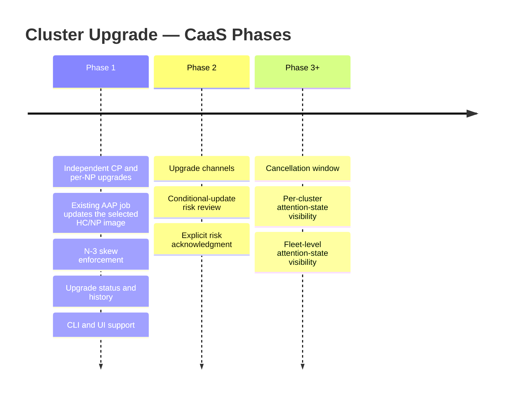

# Cluster Upgrade — CaaS

## Summary

This enhancement enables tenants to upgrade HyperShift Hosted Control Plane (HCP) OpenShift clusters through the OSAC API, CLI, and UI. It is delivered in phases. Phase 1 introduces independent, sequential CP and per-NP upgrades with version-skew enforcement, an update-only path in the existing cluster AAP job that applies the selected OpenShift release image, and upgrade status/history surfaced from HyperShift. Phase 2 adds upgrade channel management and conditional-update risk review. Later phases add a cancellation window, fleet-level notifications, and attention-state notifications for divergence and EOL conditions.

## Motivation

OSAC provisions HyperShift Hosted Control Plane clusters but currently has no API surface for upgrading them. The existing AAP create job is also used for scaling; without an upgrade-specific branch, a release-image change would rerun its installation steps. Tenants have no supported upgrade path: any direct edit to a HyperShift CRD is overwritten by OSAC's reconciler to restore the desired state. This enhancement delivers a first-class, governed upgrade workflow.

### Goals

- Enable tenants to upgrade cluster control planes and node pools through the OSAC API.
- Enforce version skew, downgrade prevention, and valid-version constraints.
- Surface upgrade state and history in `Cluster.status`.
- Provide CLI and UI coverage for upgrade initiation and monitoring.
- Lay groundwork for upgrade graph integration, risk acknowledgment, and fleet management.

### Non-Goals

- Rollback or downgrade.
- Cancel running upgrades (HyperShift does not support it).
- SNO or non-HCP clusters.
- Platform-initiated upgrades.

## Proposal

Cluster upgrades are triggered by **updating a version field on the OSAC `Cluster` resource** — `spec.version` for the control plane, `spec.node_sets[*].version` for a node pool. The fulfillment-service validates the target version, then resolves its release image from `ClusterVersion` when building the `ClusterOrder` CR; the Cluster stores version selectors, not release images. The osac-operator detects image divergence and launches the existing cluster AAP job with an upgrade operation. Its update-only branch patches `spec.release.image` on the selected existing HyperShift CR. Upgrade progress and history return through the existing private Cluster Update path; `Signal` only schedules reconciliation.

### Phase overview

### Phase 1 — Independent upgrades

Control plane and node pools are upgraded independently and sequentially. As with scaling, the operator launches the existing cluster AAP job. For an upgrade, its update-only branch patches `spec.release.image` on the target existing `HostedCluster` or `NodePool` and skips installation and post-install work. All NodePools in OSAC-provisioned HyperShift clusters currently use `spec.management.upgradeType: InPlace` because their nodes are bare metal; this choice may change when OSAC supports OpenShift Virtualization-backed clusters.

Fulfillment owns the `CanUpgrade` DB lock for initial creation and upgrades; either terminal upgrade result (success or failure) releases it without changing ClusterOrder provisioning status. Version skew (NP ≤ CP, within N-3 minor versions) is enforced at the API layer.

Upgrades are triggered through `osac edit cluster`, a new `osac upgrade cluster` command, or directly via `PATCH /clusters/{id}`.

#### Current NodePool targeting

The tenant selects a CaaS node set by name. Fulfillment finds that node set's resource class and updates the matching `ClusterOrder.spec.nodeRequests` entry. The operator matches that `NodeRequest.ResourceClass` to the existing NodePool's `osac.openshift.io/resource_class` label, then targets only that pool through AAP. Current readiness checks reject duplicate node-request resource classes and duplicate NodePool labels for one class, making this mapping unique for a ready cluster; neither list position nor the node-set name identifies a NodePool.

[OSAC-1604](https://redhat.atlassian.net/browse/OSAC-1604) is scheduled to change node-set/NodePool identity. When its mapping is available, the OSAC-1415 implementation and tests must use it for NodePool selection and status attribution. Phase 1 does not prescribe that future mapping. See `design-phase1.md` for the current flow.

See `design-phase1.md` for the full specification.

### Phase 2 — Channels and risk acknowledgment

Phase 2 adds upgrade channel management and conditional-update risk review. API changes and implementation details are deferred to the Phase 2 design.

### Phase 3+ — Operational polish

Later phases address the remaining PRD items: cancellation window (FR-6), per-cluster attention-state visibility (FR-14, FR-15), and fleet-level attention-state visibility (NFR-admin). Details deferred to per-phase designs.

## Upgrade / Downgrade Strategy

Each phase is additive and backward-compatible with Phase 1 consumers.

## Version Skew Strategy

The fulfillment-service, osac-operator, osac-aap, and osac-ui are affected in Phase 1. They ship in a coordinated deployment with the upgrade branch of the existing AAP job available before upgrade requests are enabled. New status fields degrade gracefully on older UI builds.

## Support Procedures

Upgrade state is visible in `Cluster.status.upgrade`, `ClusterOrder.status.upgradeStatus`, and Kubernetes Events on `ClusterOrder`. See `design-phase1.md` for Phase 1 recovery procedures.

## Infrastructure Needed

- Extend the existing cluster AAP job and any configured workflow with an update-only upgrade branch. The osac-operator retains read-only HyperShift access; the AAP execution identity applies the patch.

---

## Provenance

Authored: draft @ design 0.11.1 - f1d6a4b, workspace main @ b14c881c5 (dirty)
Final: revise @ design 0.11.3 - 2bd6607, workspace main @ 9c26507ef

> Context changed between draft and revise.

<!-- ai-workflow-provenance:{"schema_version":1,"provenance_kind":"session","workflow":"design","workflow_version":"0.11.3","ai_workflows":"2bd6607","source_repo":"9c26507ef","source_repo_branch":"main","commits_behind_main":0,"commits_ahead_main":0,"main_ref":"main","phases":["draft","draft","revise","revise","revise","revise","revise","revise","revise","revise","revise","revise","revise","revise","revise","revise","revise","revise","revise","revise","revise"],"authoring_modes":["skill"],"context_changed":true,"origin_untracked":false} -->
